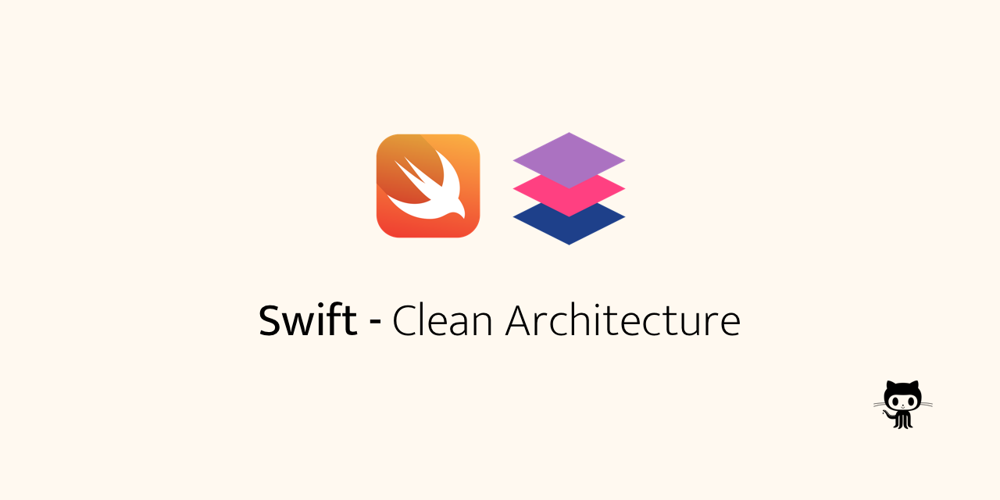

## **Clean Architecture using Swift**

Using  [Github Api](https://developer.github.com/v3/search/) para:
- List repositories
- List pull requests from some repository
- Show detail from some pull request

## Motivation
 Study about implementation, using three layers (Domain, DataSource, Presentation), in this repository I chose follow a more flexible solutions.

- Organization
- Easy to debug
- Easy to plug layers
- Componentization 
- Tests

## How works

Image from [this medium post](https://tech.olx.com/clean-architecture-and-mvvm-on-ios-c9d167d9f5b3 "this post")
## Libs
* [Alamofire](https://github.com/Alamofire/Alamofire)
* [AlamofireImage](https://github.com/Alamofire/AlamofireImage)
* [Fastlane](https://fastlane.tools)
* [R.Swift](https://github.com/mac-cain13/R.swift)
* [SwiftFormat](https://github.com/nicklockwood/SwiftFormat)
* [SwiftLint](https://github.com/realm/SwiftLint)
* [SwiftLocalhost](https://github.com/depoon/SwiftLocalhost)
* [SwiftyMocky](https://github.com/MakeAWishFoundation/SwiftyMocky)

## Roadmap
- [ ] Do more tests
- [ ] Discuss about necessity to translate Error from DataSource to Domain
- [ ] Discuss about best way to connect Domain to Presentation without external solutions

## License
This project is lincesed by MIT - look at file [LICENSE.md](LICENSE) for details.
