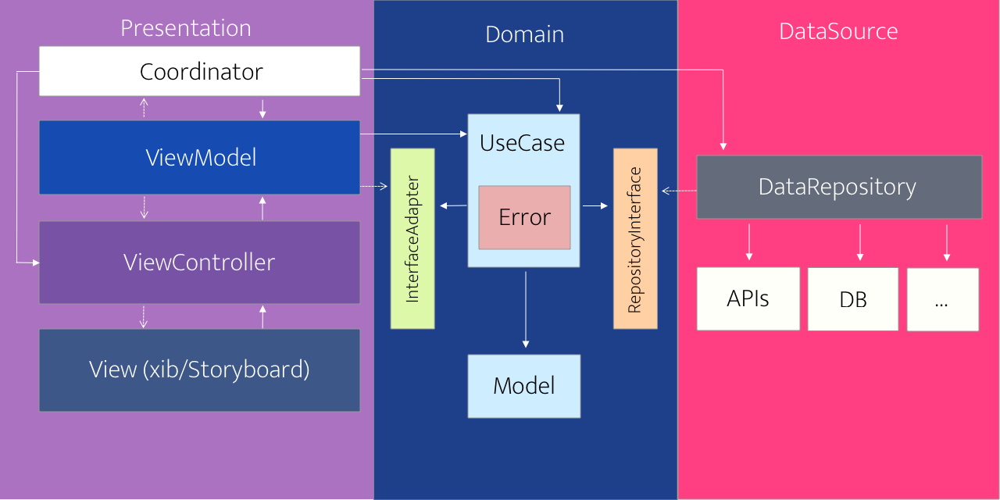

## **Clean Architecture using Swift**

Using  [Github Api](https://developer.github.com/v3/search/) para:
- List repositories
- List pull requests from some repository
- Show detail from some pull request

## Motivation
 Study about implementation, using three layers (`Domain`, `DataSource`, `Presentation`), in this repository I chose follow a more flexible solutions.

- Organization
- Easy to debug
- Easy to plug layers
- Componentization 
- Tests

## Structure

### Domain
_This layer is the main, there are all business logics and all model data struct necessary for the application._

* All communications are executed through interfaces like `InterfaceAdapter` and `RepositoryInterface`.
* `Models` are data necessary to `UseCases` logic
* `UseCases` are the main logic

### DataSource
_This layer has the reponsability to handle `APIs` calls and access to `DataBases` like `CoreData` for example._

* All repositories here extends `RepositoryInterface` and implement interfaces to `DataSources` like APIs or `CoreData` if necessary

### Presentation

_This layer has the reponsability to show and handle inputs from an interface, so in that example is implemented using like `MVVM`_

* The `Coordinator` has the responsibility to get all `DataSources`, `UseCases`, `ViewModel` and `ViewController`, so this will build everything and then show `ViewController` with your relative `ViewModel`
* `ViewModel`, in this case, extends `InterfaceAdapter` to receive responses from `UseCase` and implement `UseCase` interfaces to execute that logics 
* `ViewController`, in that case, was created only to observe `ViewModel` and modify `View` without any intelligence there.
* The view is a view, an only structure like `Xib` or `StoryBoards`.

## How works

Image from [this medium post](https://tech.olx.com/clean-architecture-and-mvvm-on-ios-c9d167d9f5b3 "this post")
## Libs
* [Alamofire](https://github.com/Alamofire/Alamofire)
* [AlamofireImage](https://github.com/Alamofire/AlamofireImage)
* [Cocoapods](https://cocoapods.org)
* [Fastlane](https://fastlane.tools)
* [R.Swift](https://github.com/mac-cain13/R.swift)
* [SwiftFormat](https://github.com/nicklockwood/SwiftFormat)
* [SwiftLint](https://github.com/realm/SwiftLint)
* [SwiftLocalhost](https://github.com/depoon/SwiftLocalhost)
* [SwiftyMocky](https://github.com/MakeAWishFoundation/SwiftyMocky)

## Roadmap
- [ ] Do more tests
- [ ] Discuss about necessity to translate Error from DataSource to Domain
- [ ] Discuss about best way to connect Domain to Presentation without external solutions

## License
This project is lincesed by MIT - look at file [LICENSE.md](LICENSE) for details.
